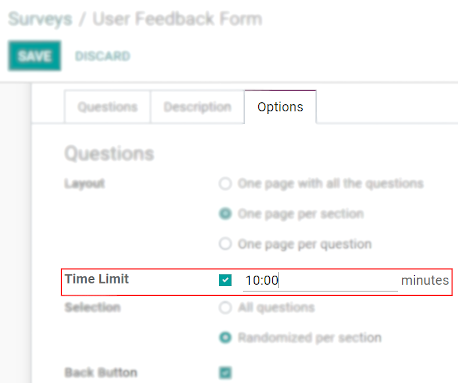
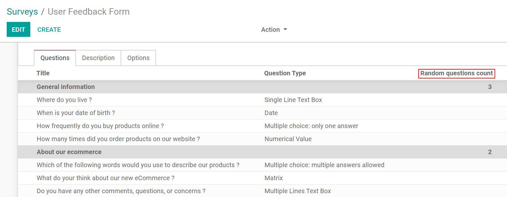

============================
Time and Randomize Questions
============================

Time Limit
==========

| On timed surveys, respondents need to complete the survey within a certain period of time. It
  creates an impact on the collection of data’s experience, as the timing controls the pace at which
  the survey is taken.
| Set the *Time limit* under the tab *Options*.

A timer is shown on the pages so the user can keep track of his time. Surveys not submitted by the
time limited do not have their answers saved.

Selection
=========

| When you randomize a survey, you allow for the questions to be shuffled in a random order every
  time someone opens the questionnaire. This can be useful to avoid having respondents looking at
  each others' answers.
| To do so, under the tab *Options*, enable *Randomized per section*. Now, on the tab *Options*, set
  how many of the questions in that section should be taken into account during the shuffling.

.. seealso::
    - :doc:`scoring`